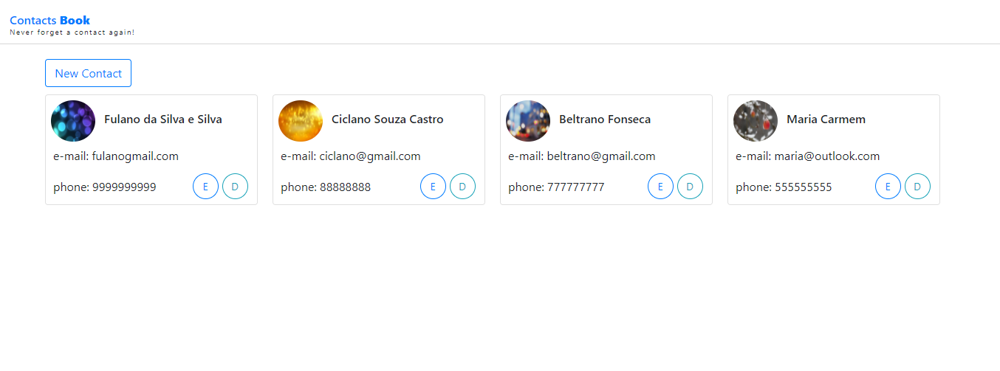
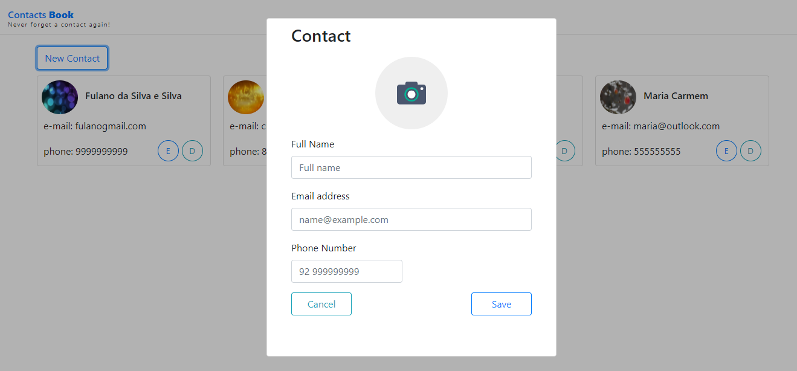

# Contacts Book

<p align="center">
   
</p>

## Projeto de Estudo com Node Js | Vue Js | MongoDB | Docker

## Descrição do Projeto
Esté é um projeto de uma agenda simples com o intuito do aprendizado das tecnologias: [Node Js] https://nodejs.org/en/, 
[VueJs] https://br.vuejs.org/, [Mongo db] https://www.mongodb.com/ e [Docker] https://www.docker.com/.

## Start do Projeto

Você precisar ter o docker intalado em sua máquina ou pode startar cada serviço individual!
As dependências serão instaladas automagicamente! rs 

### Usando Docker
```
 docker-compose up ou docker-compose up -d
```
### Start individual dos serviços
```
 yarn start
```


### Tela de criação do novo contato!
<p align="center">
   
</p>


### Projeto ainda está em constante evolução!
